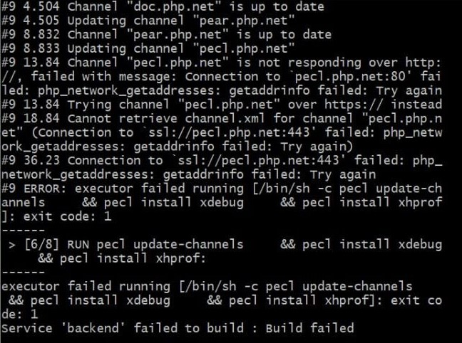

# Первое включение

#### Windows

Запустить `init.bat` ввести имя проекта, порт для XHPROF, порт для NGINX, порт для MYSQL.

#### Linux/MacOS

Запустить `init.sh` ввести имя проекта, порт для XHPROF, порт для NGINX, порт для MYSQL.

#### Общее

Если конфликтов портов не предвидится:

- XHPROF - любой, я ставлю 49999

- NGINX - 80

- MYSQL - 3306

Комманда сгенерирует `docker-compose.yml` который нужно будет запустить.

Билдим контейнер `docker-compose build`

Запускаем контейнер в фоне `docker-compose up -d`

# Логи

### PHP

Пробрасываются и пишутся логи (`./docker/php/logs/:/var/log/php/`):

- **php** (`php.ini`)
```ini
error_log=/var/log/php/php.log
```
- **xdebug** (`php.ini`)
```ini
xdebug.log=/var/log/php/xdebug.log
```
- **xhprof** (непосредственно в коде. раздел **XHPROF**)
```php
$filename = "/var/log/php/$run.$type.xhprof";
```

# XHPROF

Установка в 2 шага:

- `dockerfile` - XHProf
- `docker-compose` - XHProfUI

### Описание `dockerfile`

```dockerfile
RUN set -ex && apk add --no-cache --virtual .xhprof-deps $PHPIZE_DEPS
RUN pecl update-channels && pecl install xhprof
RUN docker-php-ext-enable xhprof
RUN apk del .xhprof-deps
```

Если, происходит ошибка, типа - 



изменить `Dockerfile` c:

```dockerfile
RUN pecl update-channels && pecl install xhprof
```

на:

```dockerfile
RUN curl "http://pecl.php.net/get/xhprof-2.3.5.tgz" -fsL -o ./xhprof-2.3.5.tgz && \
    mkdir /var/xhprof && tar xf ./xhprof-2.3.5.tgz -C /var/xhprof && \
    cd /var/xhprof/xhprof-2.3.5/extension && \
    phpize && \
    ./configure && \
    make && \
    make install
```

### Описание `docker-compose.yaml`

```yaml
xhprof:
    image: tuimedia/xhprof-docker:0.9.4
    volumes:
      - ./backend/logs/php/:/profiles/
    ports:
      - "49998:80"
```

### Использование

```php
define("XHPROF_DEBUG", extension_loaded("xhprof"));
define("XHPROF_TYPE", "projectName");

if (XHPROF_DEBUG) {
    xhprof_enable(XHPROF_FLAGS_CPU + XHPROF_FLAGS_MEMORY);
    register_shutdown_function(function () {
        $run = time();
        $type = XHPROF_TYPE;
        $filename = "/var/log/php/$run.$type.xhprof";
        file_put_contents($filename, serialize(xhprof_disable()));
    });
}
```

### Анализ

[XHProfUI](http://localhost:49998/)

# XDEBUG

### Описание `dockerfile`:

```dockerfile
RUN set -ex && apk add --no-cache --virtual .xdebug-deps $PHPIZE_DEPS
RUN pecl update-channels && pecl install xdebug
RUN docker-php-ext-enable xdebug
RUN apk del .xdebug-deps
```

Если, происходит ошибка, типа -


изменить `Dockerfile` c:

```dockerfile
RUN pecl update-channels && pecl install xdebug
```

на:

```dockerfile
RUN curl "http://pecl.php.net/get/xdebug-3.1.3.tgz" -fsL -o ./xdebug-3.1.3.tgz && \
    mkdir /var/xdebug && tar xf ./xdebug-3.1.3.tgz -C /var/xdebug && \
    cd /var/xdebug/xdebug-3.1.3 && \
    phpize && \
    ./configure && \
    make && \
    make install
```

Настройки:

- [PHP Web Page](./docs/XDEBUG-php-web-page.md)
  
- [Debug Connections](./docs/XDEBUG-php-debug-connections.md)


